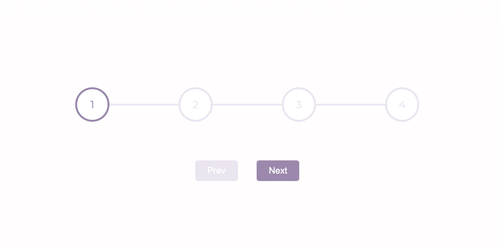

# Progress Steps

[Live Demo](https://mia-progress-steps.netlify.app/)

[50projects50days](https://github.com/bradtraversy/50projects50days)第二天的练习：Progress Steps。

## What I Learned
1. CSS: `::before`作为选中的元素前面的子元素，`::after`作为选中的元素后面的子元素。两者都经常配合`content`属性来为元素添加修饰内容。

## Reference
- [MDN - ::before](https://developer.mozilla.org/zh-CN/docs/Web/CSS/::before)

